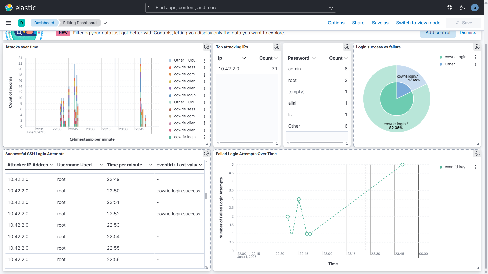
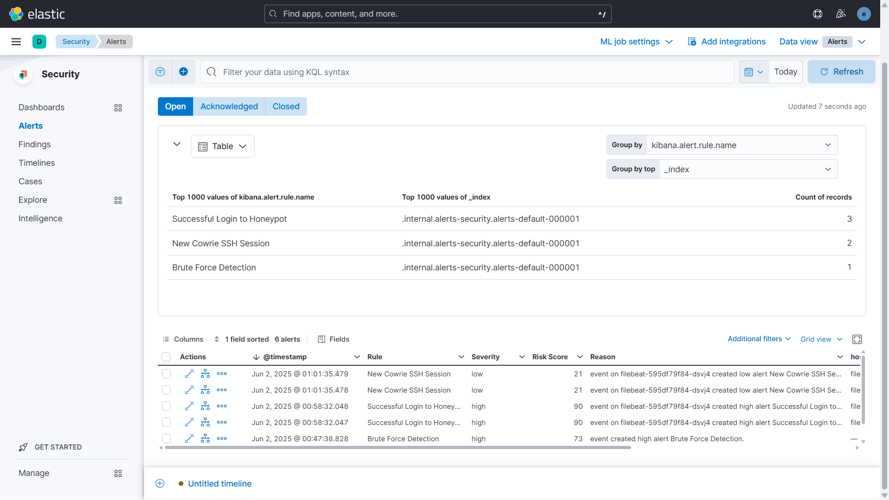

# RAMAPOT 

**Multi-Honeypot Deployment with Centralized Logging on Kubernetes**

RAMAPOT is a honeypot deployment solution that orchestrates multiple honeypots (Cowrie SSH, Elasticpot, and Redis) with centralized logging using the Elastic Stack on a k3d Kubernetes cluster.

## Features

- **Multi-Honeypot Architecture**: Deploy SSH, Elasticsearch, and Redis honeypots simultaneously
- **Centralized Logging**: Unified log collection and analysis with Elasticsearch and Kibana
- **Kubernetes**: Containerized deployment with k3d
- **Real-time Monitoring**: Live dashboards and alerting capabilities
- **Scalable Design**: Easy to extend with additional honeypots

## Prerequisites

Before starting, ensure you have the following tools installed:

- Docker
- k3d
- kubectl
- Helm
- curl (for testing Elasticpot)
- redis-cli or any Redis client (for testing Redis honeypot)

## Installation

### Step 1: Build Docker Images

#### Build Elasticpot Image
```bash
cd elasticpot
docker build -t elasticpot .
```

#### Build Redis Honeypot Image
```bash
cd redis-honeypot
docker build -t redishoneypot .
```

### Step 2: Create k3d Cluster

Create a k3d cluster with proper port forwarding:

```bash
k3d cluster create mycluster \
  -p "30022:30022@server:0" \
  -p "6379:6379@server:0" \
  -p "9200:9200@server:0" \
  -p "5601:5601@server:0" \
  --agents 2
```

**Port Mapping:**
- `30022` → Cowrie SSH service
- `9200` → Elasticpot HTTP service  
- `6379` → Redis honeypot
- `5601` → Kibana dashboard

### Step 3: Import Docker Images

```bash
k3d image import elasticpot -c mycluster
k3d image import redishoneypot -c mycluster
```

### Step 4: Create Namespace

```bash
kubectl create namespace honeypot
```

## Deployment

### Deploy Cowrie Components

```bash
kubectl apply -f cowrie-pvc.yaml -n honeypot
kubectl apply -f cowrie-configmap.yaml -n honeypot
kubectl apply -f cowrie-deployment.yaml -n honeypot
kubectl apply -f cowrie-service.yaml -n honeypot
```

### Deploy Elasticpot Components

```bash
kubectl apply -f elasticpot-pvc.yaml -n honeypot
kubectl apply -f elasticpot-configmap.yaml -n honeypot
kubectl apply -f elasticpot-deployment.yaml -n honeypot
kubectl apply -f elasticpot-service.yaml -n honeypot
```

### Deploy Redis Honeypot Components

```bash
kubectl apply -f redishoneypot-pvc.yaml -n honeypot
kubectl apply -f redishoneypot-deployment.yaml -n honeypot
kubectl apply -f redishoneypot-service.yaml -n honeypot
```

## Elastic Stack Setup

### Install Elasticsearch

```bash
helm repo add elastic https://helm.elastic.co
helm repo update
helm install elasticsearch elastic/elasticsearch -n honeypot
```

**Wait for Elasticsearch to be ready:**
```bash
kubectl get pods -n honeypot -w
```

**Retrieve Elasticsearch Password:**
```bash
kubectl get secrets --namespace=honeypot elasticsearch-master-credentials -ojsonpath='{.data.password}' | base64 -d
```

> ⚠️ **Important**: Update the retrieved password in all Filebeat configuration files.

### Install Kibana

```bash
helm install kibana elastic/kibana -n honeypot -f kibana-values.yaml
```

**Wait for Kibana to be ready:**
```bash
kubectl get pods -n honeypot -w
```

### Deploy Filebeat Instances

#### Filebeat for Cowrie
```bash
kubectl apply -f filebeat-cowrie-configmap.yaml -n honeypot
kubectl apply -f filebeat-cowrie-deployment.yaml -n honeypot
```

#### Filebeat for Elasticpot
```bash
kubectl apply -f filebeat-elasticpot-configmap.yaml -n honeypot
kubectl apply -f filebeat-elasticpot-deployment.yaml -n honeypot
```

#### Filebeat for Redis
```bash
kubectl apply -f filebeat-redis-configmap.yaml -n honeypot
kubectl apply -f filebeat-redis-deployment.yaml -n honeypot
```

## Verification

### Check All Pods Status

```bash
kubectl get pods -n honeypot
```

All pods should be in `Running` state.

## Testing Honeypots

### Test Cowrie (SSH Honeypot)

```bash
ssh -p 30022 root@localhost
```

### Test Elasticpot (Elasticsearch Honeypot)

```bash
curl -XGET http://localhost:9200/
curl -XGET http://localhost:9200/_cluster/health
```

### Test Redis Honeypot

```bash
redis-cli -h 127.0.0.1 -p 6379
# Try commands: INFO, GET test, SET test value, FLUSHALL, etc.
```

## Kibana Configuration

### Access Kibana Dashboard

Navigate to: `http://localhost:5601`

**Login Credentials:**
- **Username**: `elastic`
- **Password**: (use the password retrieved in Elastic Stack Setup)

### Configure Data Views

1. Go to **Stack Management** → **Data Views**
2. Click **Create data view**
3. Create the following data views:

#### Cowrie Logs
- **Index pattern**: `honeypot-cowrie-*`
- **Time field**: `@timestamp`

#### Elasticpot Logs
- **Index pattern**: `honeypot-elasticpot-*`
- **Time field**: `@timestamp`

#### Redis Logs
- **Index pattern**: `honeypot-redis-*`
- **Time field**: `@timestamp`
- **Filter**: `event.dataset: "redis.honeypot"`

### Create Dashboards

Build visualizations for comprehensive monitoring:

- **Time-based Charts**: Line charts and bar charts for temporal analysis
- **Data Tables**: Top IPs, usernames, and executed commands
- **Pie Charts**: Success/failure ratios and attack distribution
- **Metrics**: Total events count and connection statistics



## Security Monitoring

### Create Detection Rules

1. Go to **Security** → **Manage** → **Rules**
2. Click **Create rule**
3. Configure detection rules based on security requirements

#### Example Alert Types:

- **Brute Force Detection**: Multiple failed authentication attempts
- **Successful Honeypot Logins**: Legitimate access to honeypots

View generated alerts in **Security** → **Alerts**



## Troubleshooting

### Check Pod Status

```bash
kubectl get pods -n honeypot
kubectl describe pod <pod-name> -n honeypot
kubectl logs <pod-name> -n honeypot
```

### Check Services

```bash
kubectl get services -n honeypot
```

### Common Issues

- **Pod Not Starting**: Check resource limits and image availability
- **Connection Refused**: Verify port forwarding and service configuration
- **Log Ingestion Issues**: Ensure Filebeat configuration matches Elasticsearch credentials

## Cleanup

To remove the entire RAMAPOT deployment:

```bash
k3d cluster delete mycluster
```


## Contributing

Contributions are welcome! Please feel free to submit pull requests or open issues for bugs and feature requests.
Feel free to fork this repository and adapt it to your specific needs.

## License

This project is licensed under the MIT License - see the LICENSE file for details.

---

**RAMAPOT** - Comprehensive Honeypot Deployment Solution